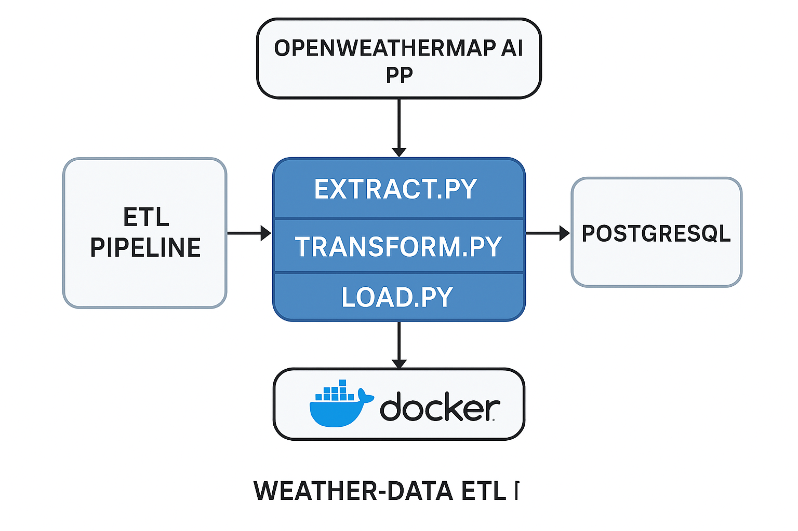

# ETL Pipeline: Weather Data

## Overview
This project demonstrates a complete ETL (Extract, Transform, Load) pipeline for weather data using Python, PostgreSQL, and Docker.

### Features
- Extract weather data from OpenWeatherMap API
- Transform data using Pandas
- Load data into PostgreSQL database
- Containerized with Docker Compose

### Tech Stack
- Python
- PostgreSQL
- Docker
- Pandas

### How to Run
1. Clone the repository
2. Navigate to `weather-data-etl-pipeline` folder
3. Run `docker-compose up`
4. Execute `main.py` to start the ETL process

### Architecture

